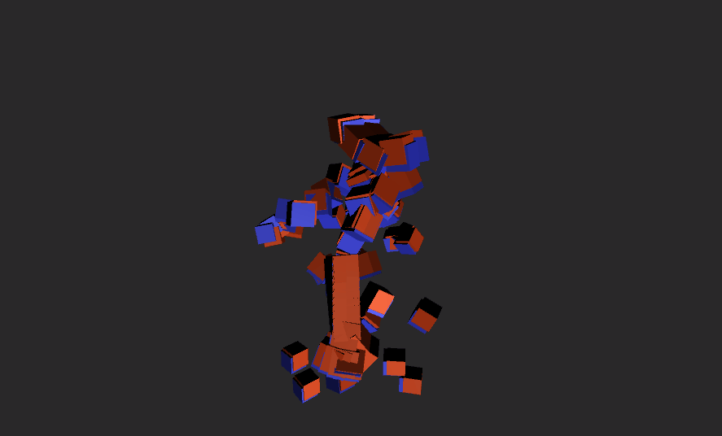

# unity-animation-compresesor
Unity skeletal animation compressor

## Result
  
Red - Original clip (12,054KB)  
Blue - Compressed clip (2,568KB)  

## Quickstart
1. Import [AnimationCompressor.unitypackage](https://github.com/fish-ken/unity-animation-compressor/releases)
1. Click menu in Tools/Optimization/Animation/Animation Compressor/Open
1. Insert your animation clip copy in Target AnimationClip  
1. Adjust some options  
1. Click Compress button
1. Or, just right click animation clip and click Assets/Optimization/Animation/Compress Animation Clip

## WIP
1. Accurate end point node (hand, feet)

## Contribution
Contributions are always welcome.
Create [Issue](https://github.com/fish-ken/unity-animation-compressor/issues) or [Pull Request](https://github.com/fish-ken/unity-animation-compressor/pulls).

 
